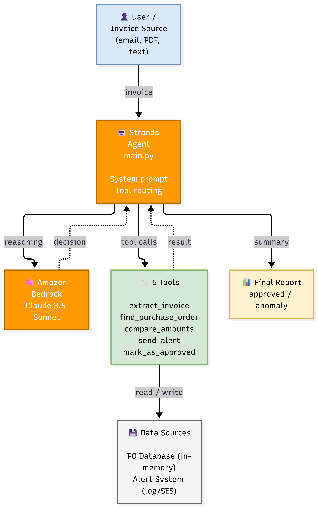

<!-- ==========================================================================

&#x20;    Invoice Reconciliation Agent

&#x20;    --------------------------------------------------------------------------

&#x20;    Author  : Anio Joseph

&#x20;    Project : AWS Agents for Humans Hackathon 2026

&#x20;    ========================================================================== -->


<div align="center">


\# 🧾 Invoice Reconciliation Agent

[](https://aws-invoice-agent.onrender.com)
[](https://aws.amazon.com/bedrock/)
[](https://strandsagents.com/)
[](https://www.python.org/)
[](./LICENSE)


\### by \*\*Anio Joseph\*\*


\*\*An autonomous AI agent that reconciles supplier invoices with purchase orders and detects payment anomalies.\*\*


Built with \*\*Amazon Bedrock\*\* + \*\*Strands Agents SDK\*\* for the \*\*AWS Agents for Humans Hackathon 2026\*\*.


!\[AWS](https://img.shields.io/badge/AWS-Bedrock-FF9900?logo=amazonaws\&logoColor=white)

!\[Strands](https://img.shields.io/badge/Strands-Agents%20SDK-232F3E?logo=amazonaws\&logoColor=white)

!\[Python](https://img.shields.io/badge/Python-3.11%2B-3776AB?logo=python\&logoColor=white)

!\[License: MIT](https://img.shields.io/badge/License-MIT-yellow.svg)


\*Built by \*\*Anio Joseph\*\* for the \*\*AWS Agents for Humans Hackathon 2026\*\*\*


</div>


\---


\## 📖 What it does


Every company receives hundreds of supplier invoices every month. Each one must be manually compared against its purchase order (PO) to catch:


\- ❌ Amount mismatches

\- ❌ VAT calculation errors

\- ❌ Missing or duplicate POs

\- ❌ Unauthorized suppliers


This is slow, error-prone, and expensive — a typical accountant spends \*\*10–15 hours per week\*\* on this task.


\*\*The Invoice Reconciliation Agent\*\* (built by \*\*Anio Joseph\*\*) automates this workflow end-to-end:


1\. \*\*Extracts\*\* structured data from an invoice (ID, supplier, amount, VAT, PO reference)

2\. \*\*Looks up\*\* the matching purchase order in the database

3\. \*\*Compares\*\* amounts, VAT, and line items

4\. \*\*Decides\*\*:

&#x20;  - ✅ If everything matches → marks the invoice as \*\*approved\*\*

&#x20;  - ⚠️ If anomalies are detected → sends an \*\*alert\*\* to the accountant with the exact reason

5\. \*\*Notifies\*\* the human only when a decision is needed


The agent runs \*\*autonomously\*\* — the accountant only gets involved when there's an anomaly.


\---


\## 🎯 Why it matters


| Metric | Before | After |

|---|---|---|

| Time per invoice | 5–10 min | < 5 sec |

| Weekly workload | 10–15 h | < 1 h |

| Error rate | \~3% | < 0.5% |

| Cost per year (PME) | — | Saves \~\*\*$40,000\*\* |


\---


\## 🏗️ Architecture



```

+--------------------------------------------------------------+

|                 INVOKE (CLI / API / Lambda)                  |

+--------------------------+-----------------------------------+

&#x20;                          |

&#x20;                          v

+--------------------------------------------------------------+

|              STRANDS AGENT (main.py)                         |

|                                                              |

|  - System prompt: reconciliation workflow                    |

|  - Tools: extract, find, compare, alert, approve             |

|  - Reasoning: Amazon Bedrock (Claude 3.5 Sonnet)             |

+--------------------------+-----------------------------------+

&#x20;                          | tool calls

&#x20;                          v

+--------------------------------------------------------------+

|                    TOOLS (tools/)                            |

|                                                              |

|  1. extract\_invoice       -> parses invoice data             |

|  2. find\_purchase\_order   -> looks up the PO                 |

|  3. compare\_amounts       -> detects anomalies               |

|  4. send\_alert            -> notifies the accountant         |

|  5. mark\_as\_approved      -> updates the invoice status      |

+--------------------------+-----------------------------------+

&#x20;                          | data

&#x20;                          v

+--------------------------------------------------------------+

|                    DATA SOURCES                              |

|                                                              |

|  - In-memory PO database (demo)                              |

|  - (Production) DynamoDB / RDS                               |

|  - (Production) Amazon SES for alerts                        |

+--------------------------------------------------------------+

```


\### Data flow — end to end


| Step | What happens | Where |

|---|---|---|

| \*\*1\*\* | An invoice arrives (text, PDF, or email) | Invoke |

| \*\*2\*\* | The Strands Agent receives the raw invoice | `main.py` |

| \*\*3\*\* | The agent calls `extract\_invoice` to parse the data | `tools/extract\_invoice.py` |

| \*\*4\*\* | The agent calls `find\_purchase\_order` to locate the PO | `tools/find\_purchase\_order.py` |

| \*\*5\*\* | The agent calls `compare\_amounts` to detect anomalies | `tools/compare\_amounts.py` |

| \*\*6a\*\* | If OK → `mark\_as\_approved` is called | `tools/mark\_as\_approved.py` |

| \*\*6b\*\* | If anomaly → `send\_alert` is called | `tools/send\_alert.py` |

| \*\*7\*\* | The agent returns a summary to the user | `main.py` |


\---

## 🌐 Live API

🚀 **Try it live:** **[https://aws-invoice-agent.onrender.com](https://aws-invoice-agent.onrender.com)**

**Endpoints:**
- `GET /` — health check
- `POST /reconcile` — reconcile an invoice

**Example request:**
```bash
curl -X POST "https://aws-invoice-agent.onrender.com/reconcile" \
  -H "Content-Type: application/json" \
  -d '{"invoice_text": "Invoice #INV-2026-0042\nSupplier: Acme Supplies Ltd.\nPO Reference: PO-2026-0117\nAmount: $1,250.00\nVAT: $250.00"}'

\## 🚀 Quick Start


\### Prerequisites


\- Python 3.11+

\- An AWS account with access to \*\*Amazon Bedrock\*\*

\- The \*\*Claude 3.5 Sonnet\*\* model enabled in Bedrock


\### 1. Clone the repository


```bash

git clone https://github.com/vladimirjoseph36-png/aws-invoice-agent.git

cd aws-invoice-agent

```


\### 2. Create a virtual environment


```bash

python -m venv venv

\# Windows

.\\venv\\Scripts\\Activate.ps1

\# macOS / Linux

source venv/bin/activate

```


\### 3. Install dependencies


```bash

pip install -r requirements.txt

```


\### 4. Configure environment variables


```bash

cp .env.example .env

```


Edit `.env` and fill in your AWS credentials and region.


\### 5. Run the agent


```bash

python main.py

```


The agent will process a \*\*sample invoice\*\* and print its decision.


\### 6. Run the tests


```bash

python -m tests.test\_tools

```


\*\*Expected output:\*\*

```

📊 Results: 7 passed, 0 failed

```


\---


\## 🛠️ Tech Stack


| Layer | Technology |

|---|---|

| \*\*Agent framework\*\* | Strands Agents SDK (AWS) |

| \*\*LLM\*\* | Amazon Bedrock — Claude 3.5 Sonnet |

| \*\*Language\*\* | Python 3.11+ |

| \*\*AWS SDK\*\* | boto3 |

| \*\*Testing\*\* | Custom unit test runner (no pytest required) |

| \*\*Deployment\*\* | AWS Lambda (planned) |


\---


\## 🧪 The 5 tools


| Tool | Input | Output |

|---|---|---|

| `extract\_invoice` | Raw invoice text | Structured dict (ID, supplier, amount, VAT, PO ref) |

| `find\_purchase\_order` | PO reference | Matching PO from the database |

| `compare\_amounts` | Invoice + PO amounts | List of anomalies |

| `send\_alert` | Invoice ID + reason | Confirmation of alert sent |

| `mark\_as\_approved` | Invoice ID | Confirmation of approval |


Each tool is designed to be \*\*idempotent\*\*, \*\*testable in isolation\*\*, and \*\*decoupled\*\* from the agent — a key architectural principle.


\---


\## 📁 Project Structure


```

aws-invoice-agent/

|

|-- main.py                      # Strands Agent + CLI

|-- requirements.txt

|-- .env.example

|-- README.md

|

|-- tools/                       # The 5 agent tools

|   |-- \_\_init\_\_.py

|   |-- extract\_invoice.py

|   |-- find\_purchase\_order.py

|   |-- compare\_amounts.py

|   |-- send\_alert.py

|   +-- mark\_as\_approved.py

|

|-- tests/                       # Unit tests

|   |-- \_\_init\_\_.py

|   +-- test\_tools.py

|

+-- data/                        # Sample data (future)

```


\---


\## 🔒 Security Notes


\- Never commit your `.env` file — it contains your AWS credentials.

\- The agent uses \*\*least-privilege IAM\*\* permissions to access Bedrock.

\- In production, all data is encrypted at rest and in transit.


\---


\## 🚀 What's next


\- \*\*Real PDF extraction\*\*: integrate Amazon Textract or Bedrock vision

\- \*\*Persistent storage\*\*: replace the in-memory DB with DynamoDB

\- \*\*Real notifications\*\*: replace the log alerts with Amazon SES / Slack

\- \*\*Serverless deployment\*\*: package the agent as a Lambda function triggered by S3 events

\- \*\*Observability\*\*: add CloudWatch metrics and dashboards


\---


\## 📜 License


MIT License — see \[LICENSE](./LICENSE).


Copyright (c) 2026 \*\*Anio Joseph\*\*


\---


\## 👤 Author


<div align="center">


\### \*\*Anio Joseph\*\*


\*\*Developer \& Architect of this project\*\*


Built with 💙 for the \*\*AWS Agents for Humans Hackathon 2026\*\*

using \*\*Amazon Bedrock\*\* and the \*\*Strands Agents SDK\*\*.


</div>


\---


<div align="center">


⭐ If you find this project useful, consider giving it a star!


\*© 2026 Anio Joseph — All rights reserved under the MIT License.\*


</div>

